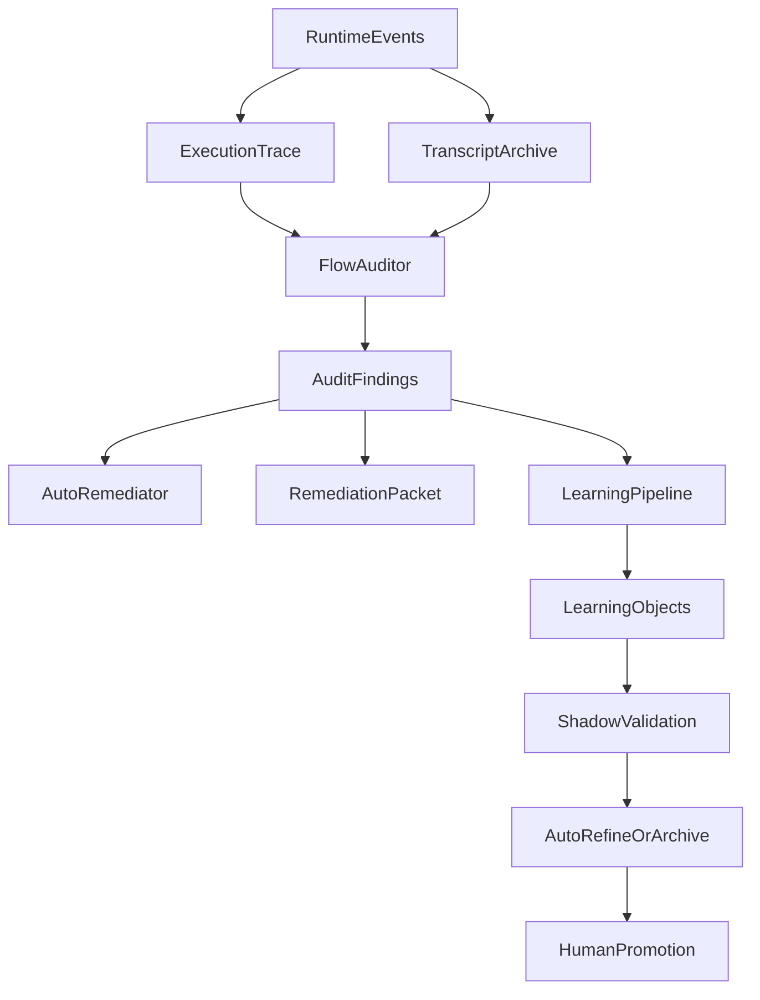

下面是我建议的增强版 plan 内容，可以作为对 `\root\.cursor\plans\运行审计自动纠偏_255f0f9e.plan.md` 的直接扩展版本。

# Stage-Harness 运行审计与受控自学习增强计划

## 目标
1. 为 `stage-harness` 建立完整运行证据链，支持事后排查。
2. 基于运行记录判断插件是否按预期流程工作。
3. 对低风险流程偏差自动纠偏，对高风险偏差生成待确认修复包。
4. 在受控边界内引入自学习能力，让插件逐步沉淀有效模式、审计规则和修复策略。
5. 保证整个学习与纠偏过程可追踪、可回放、可回滚，而不是黑箱自改。

## 最终效果
完成后，`stage-harness` 应具备以下能力：

- 每次运行都能留下原始 transcript 归档和结构化执行轨迹。
- 能自动审计本次运行是否符合 `CLARIFY -> SPEC -> PLAN -> EXECUTE -> VERIFY -> FIX -> DONE` 的预期流程。
- 能识别阶段跳转错误、gate 绕过、receipt 缺失、idle 异常、编排偏差等问题。
- 能对日志、索引、元数据、轻量文档一致性等低风险问题自动修复并留痕。
- 能把高风险问题转成待确认 `remediation-packet`，而不是直接改流程语义。
- 能从运行记录中沉淀项目级经验，并在后续 epic 中以 shadow mode 验证学习结果。
- 能对“学习对象”做分级治理，避免误学、过拟合、跨项目污染。

## 总体架构
采用五层闭环，而不是只做日志落盘。

## 核心设计原则
- 先可观测，再审计，再自动修复，最后才做自学习。
- 自学习只允许在受控白名单内发生，不能直接修改流程真值。
- 候选规则先 shadow validate，再决定是否提升。
- 所有学习结果都必须带证据来源。
- 必须记录负样本、误判、回滚，不允许只积累成功案例。
- project-local 优先，避免学习结果跨项目污染。

## 运行日志与审计层

### 原始日志归档
目标是保留宿主侧真实运行痕迹。

建议新增目录：
- `.harness/logs/sessions/<session-id>.jsonl`
- `.harness/logs/index.json`

接入点：
- `stage-harness/hooks/scripts/stop.sh`

实现要求：
- 若 hook payload 中存在 `transcript_path`，在 `Stop` 时归档 transcript。
- 记录 `session_id`、`started_at`、`stopped_at`、`cwd`、`epic_ids`、`transcript_archive_path`。
- 若 transcript 不可读，只记录 `archive_skipped`，不阻断主流程。

### 结构化执行轨迹
目标是形成稳定、可规则分析的执行事实流。

建议新增目录：
- `.harness/logs/epics/<epic-id>/execution-trace.jsonl`
- `.harness/logs/epics/<epic-id>/audit-findings.json`
- `.harness/logs/epics/<epic-id>/audit-summary.md`
- `.harness/logs/epics/<epic-id>/autofix-history.json`

建议新增脚本：
- `stage-harness/hooks/scripts/trace-append.sh`

统一事件字段：
- `ts`
- `session_id`
- `epic_id`
- `stage`
- `source`
- `event_type`
- `status`
- `task_id`
- `agent_name`
- `tool_name`
- `summary`
- `payload`
- `artifact_paths`

hook 接入点：
- `stage-harness/hooks/scripts/session-start.sh`
- `stage-harness/hooks/scripts/stage-reminder.sh`
- `stage-harness/hooks/scripts/pre-tool-use.sh`
- `stage-harness/hooks/scripts/task-completed.sh`
- `stage-harness/hooks/scripts/teammate-idle.sh`
- `stage-harness/hooks/scripts/stop.sh`

`harnessctl` 接入点：
- `stage-harness/scripts/harnessctl.py` 的 `cmd_state_transition`
- `stage-harness/scripts/harnessctl.py` 的 `cmd_stage_gate_check`
- `stage-harness/scripts/harnessctl.py` 的 `_update_task_status`
- `stage-harness/scripts/harnessctl.py` 的 `cmd_receipt_write`
- `stage-harness/scripts/harnessctl.py` 的 `cmd_guard_check`
- `stage-harness/scripts/harnessctl.py` 的 `cmd_gate_skip`

## 流程符合性分析器

### 新增能力
建议新增：
- `stage-harness/agents/flow-auditor.md`
- `stage-harness/commands/harness-audit.md`

并在 `stage-harness/scripts/harnessctl.py` 增加：
- `audit run`
- `audit show`

### 规则型审计
优先做低误报、可自动修复的规则审计：

- 阶段跳转不符合状态机。
- 未过上一阶段 gate 就进入下一阶段。
- `EXECUTE/FIX` 中任务完成但缺失 receipt。
- 已有 pending/in_progress 任务却进入 idle。
- `gate skip` 缺失 justification 或补救记录。
- session 停止时活跃 epic 缺少 handoff 或 trace 终止事件。

### 模式型审计
默认只产出 findings，不直接自动修复：

- 要求开启 subagent/team，但轨迹中没有证据。
- 阶段异常回退或重试过多。
- 生成的产物未被后续阶段消费。
- 命令文档要求的并行/串行编排与实际顺序不一致。

## 自动纠偏层

### 新增能力
建议新增：
- `stage-harness/agents/flow-remediator.md`
- `stage-harness/templates/remediation-packet.json`

### 允许自动修复的低风险问题
- trace 文件缺失或索引缺失。
- handoff 元数据缺失。
- 非关键日志目录不存在。
- 可由现有状态重建的审计索引缺失。
- 轻量文档与 hook/命令清单不一致。
- 可确定的 trace 事件未写入，可补建历史索引。

### 不允许自动修复的问题
- 状态机定义变更。
- gate 规则语义变更。
- agent 编排角色或 council 组成调整。
- subagent/team 启用策略调整。
- 任何会改变 `.harness/features/<epic-id>/state.json` 真值的修正。

### 自动修复要求
每次自动修复都必须留下：
- 修复前快照摘要
- 修复动作
- 修复后验证结果
- 回滚建议
- 风险级别
- 触发该修复的 finding ID

## 受控自学习层

### 学习对象分层
新增统一 learning object 模型，至少分成五类：

- `observation`
- `pattern`
- `candidate-skill`
- `candidate-remediation-rule`
- `promoted-policy`

建议目录：
- `.harness/memory/observations.jsonl`
- `.harness/memory/project-patterns.json`
- `.harness/memory/candidate-skills/`
- `.harness/memory/candidate-remediation-rules/`
- `.harness/memory/promoted-policies.json`

### 学习输入信号
学习不能只基于“模型觉得有效”，必须依赖明确反馈：

- `stage-gate` 是否通过
- `council` verdict
- receipt 是否完整
- 是否发生回退、重试、blocked
- autofix 后是否再次报错
- 人工是否接受、拒绝、回滚修复
- 同类问题是否重复出现

### Shadow Validate
所有候选能力先影子验证，不直接生效。

建议做法：
- 新 candidate skill 不直接进入正式 `skills/`
- 新 candidate remediation rule 不直接进入自动修复白名单
- 在下一次相关 epic 中 shadow 运行，比较其建议与实际结果是否一致
- 将 shadow 结果写入 `observations.jsonl`

### Replay Backtest
新增离线回放验证，用历史 trace 和 findings 回测新规则：

- 用历史 `execution-trace.jsonl` 回放流程审计规则
- 验证新规则是否会误判
- 验证 candidate remediation rule 是否会触发错误修复
- 只有 replay 和 shadow 都通过，才允许进入 promotion 阶段

### 自学习作用域隔离
学习结果必须带作用域，避免污染：

- `project-local`
- `plugin-global`
- `stage-scoped`
- `risk-scoped`

默认策略：
- observation 和 pattern 默认 project-local
- candidate skill 默认 project-local
- promoted policy 需要人工审批后才允许 plugin-global

### 负样本与抑制机制
必须记录失败和误修：

- 被人工回滚的 autofix 进入 suppression list
- 连续 shadow 失配的 candidate rule 自动降级
- 命中率低的 candidate skill 自动归档
- replay 失败的规则禁止 promotion

### 衰减与淘汰
学习结果需要 TTL 和衰减：

- 长期未命中的 pattern 自动降权
- 近期误判增多的规则自动降级
- 项目结构变化后旧规则进入 revalidate 状态
- 长期无效的 candidate 对象归档而非无限堆积

### 学习过程可观测
学习本身也必须有审计轨迹：

- 何时挖掘出新 pattern
- 何时进入 shadow validate
- 命中率是多少
- 何时 auto-refine
- 何时 ready for promotion
- 何时被拒绝或回滚

## 与现有 memory / skill-miner 的关系
现有能力保留，但升级为完整管线的一部分。

保留：
- `stage-harness/skills/memory/SKILL.md`
- `stage-harness/agents/skill-miner.md`
- `harnessctl memory append-pitfalls`

增强：
- `skill-miner` 不再只产出候选 skill，还可产出候选 remediation rule
- 现有 `candidate-skills` 接入 shadow validate 和 replay backtest
- `pitfalls.md` 继续保留，但只作为人类可读摘要，不作为唯一学习真值
- `project-patterns.json` 升级为结构化 learning objects 的索引入口

## 分期开发计划

## Phase 0：治理模型与 schema
目标是先把对象模型和边界定义清楚，避免后续返工。

交付物：
- execution trace schema
- audit finding schema
- remediation packet schema
- learning object schema
- auto-fix 白名单/黑名单
- promotion 规则和 suppression 规则

关键文件：
- `stage-harness/docs/architecture.md`
- `stage-harness/templates/remediation-packet.json`
- 新增 learning schema 文档或模板文件

验收标准：
- 所有新增对象的字段定义明确
- 自动修复边界可被机器判定
- 自学习对象有清晰生命周期

## Phase 1：可观测性基础设施
目标是先把日志打全。

交付物：
- transcript archive
- `trace-append.sh`
- hook trace 落盘
- `harnessctl` 关键事件落盘

关键文件：
- `stage-harness/hooks/scripts/stop.sh`
- `stage-harness/hooks/scripts/session-start.sh`
- `stage-harness/hooks/scripts/stage-reminder.sh`
- `stage-harness/hooks/scripts/pre-tool-use.sh`
- `stage-harness/hooks/scripts/task-completed.sh`
- `stage-harness/hooks/scripts/teammate-idle.sh`
- `stage-harness/scripts/harnessctl.py`

验收标准：
- 一次完整 epic 运行后，能看到 transcript archive
- 每个关键阶段和 task 生命周期都有 trace
- trace 可根据 `epic_id` 和 `session_id` 查询

## Phase 2：流程符合性审计
目标是基于 trace 做稳定审计。

交付物：
- `flow-auditor`
- `harness audit run`
- `harness audit show`
- `audit-findings.json`
- `audit-summary.md`

关键文件：
- `stage-harness/agents/flow-auditor.md`
- `stage-harness/commands/harness-audit.md`
- `stage-harness/scripts/harnessctl.py`

验收标准：
- 能识别阶段跳转、gate、receipt、idle 等核心偏差
- findings 可分为低风险自动修复和高风险人工确认
- 审计结果可重跑、可复现

## Phase 3：低风险自动纠偏
目标是实现最小可用的 auto-remediation。

交付物：
- `flow-remediator`
- `remediation-packet.json`
- `autofix-history.json`
- auto-fix 风险分级器

关键文件：
- `stage-harness/agents/flow-remediator.md`
- `stage-harness/templates/remediation-packet.json`
- `stage-harness/scripts/harnessctl.py`

验收标准：
- 低风险问题可自动修复并留痕
- 高风险问题只生成 packet，不直接改
- 自动修复可回滚、可验证

## Phase 4：受控自学习 MVP
目标是先把学习闭环跑通，但只做最小可用版本。

交付物：
- learning object 目录结构
- observation 写入机制
- candidate remediation rule 生成
- shadow validate 机制
- suppression list

关键文件：
- `stage-harness/skills/memory/SKILL.md`
- `stage-harness/agents/skill-miner.md`
- 新增 `candidate-remediation-rules` 相关文件
- `stage-harness/commands/harness-done.md`

验收标准：
- 一次 epic 完成后，能生成 observation、pattern、candidate skill 或 candidate remediation rule
- 新候选规则不会直接生效，而是进入 shadow validate
- 被回滚或失配的规则能被抑制

## Phase 5：Replay Backtest 与 Promotion
目标是把学习结果从“候选”提升到“可信”。

交付物：
- replay backtest 工具
- shadow 结果统计
- auto-refine 逻辑
- promotion 流程
- archived / ready_for_promotion 状态流转

关键文件：
- `stage-harness/skills/skill-evolution/SKILL.md`
- `stage-harness/scripts/harnessctl.py`
- 相关 memory 目录和元数据文件

验收标准：
- candidate skill 和 candidate remediation rule 可基于历史数据回测
- 命中率、误判率、回滚率可追踪
- 达标对象才能进入 promotion

## Phase 6：文档、回放验证与灰度落地
目标是让能力可用、可教、可控。

交付物：
- 使用文档
- 运维排查手册
- 学习治理手册
- 灰度启用策略

关键文件：
- `stage-harness/docs/README.md`
- `stage-harness/docs/usage.md`
- `stage-harness/docs/architecture.md`

验收标准：
- 新用户知道如何看日志、跑审计、查看 autofix 历史
- 开发者知道如何查看 learning object、shadow 结果、suppression 记录
- 低风险自动修复可按开关灰度启用

## 推荐实施顺序
如果你想控制风险，我建议按这个顺序推进：

1. `Phase 0 + Phase 1`
先把 schema 和日志打底做出来。

2. `Phase 2`
先具备流程审计能力，确认“看得见、判得准”。

3. `Phase 3`
再开放低风险自动纠偏。

4. `Phase 4`
再接入受控自学习 MVP。

5. `Phase 5 + Phase 6`
最后补 replay、promotion 和治理文档。

## 风险边界
- 不把 transcript 当唯一真相源，trace 才是正式审计基线。
- 不允许自动修改状态机、gate 语义、agent team 策略。
- 不允许未经 shadow 和 replay 验证的规则直接生效。
- 不允许跨项目默认复用学习结果。
- 不允许只记录成功样本，必须记录误判、回滚、抑制和淘汰。

## 一句话总结
这版 plan 的目标不是让 `stage-harness` 变成“会自我乱改的系统”，而是把它升级成：

`一个有完整运行证据、能自动审计流程符合性、能低风险自动纠偏、并通过 shadow/replay 受控自学习的 harness。`
